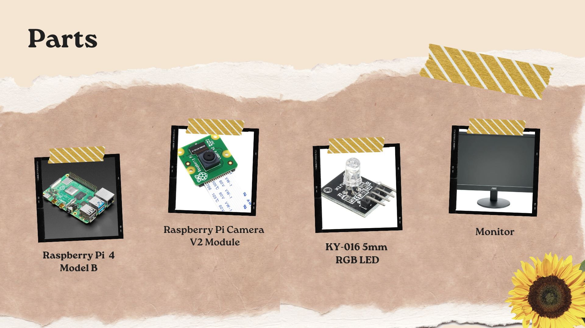
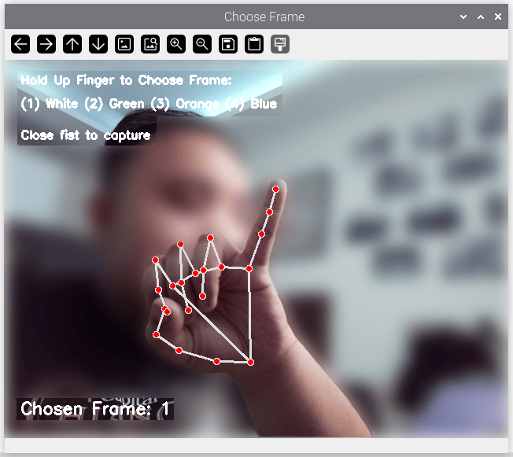
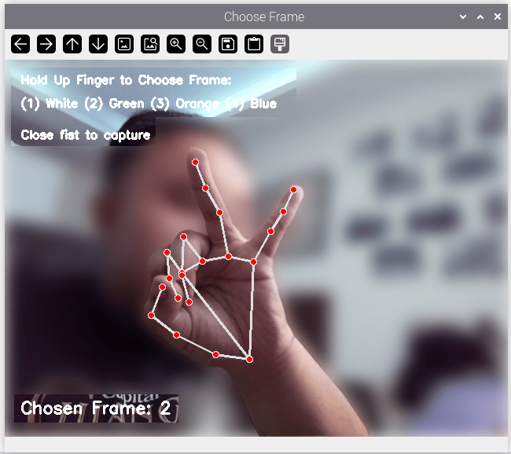
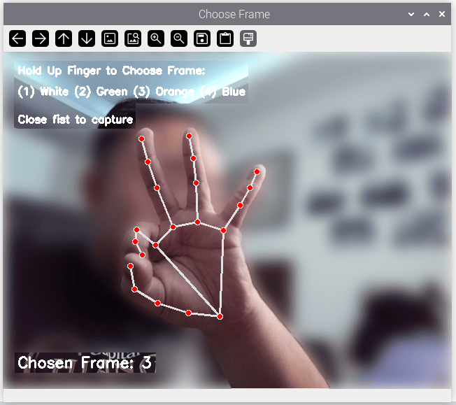
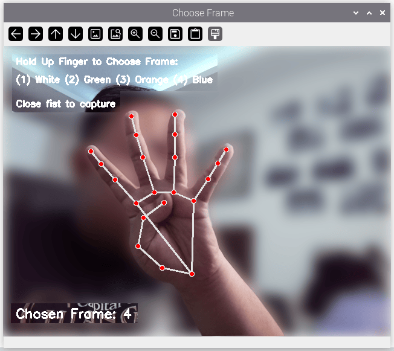
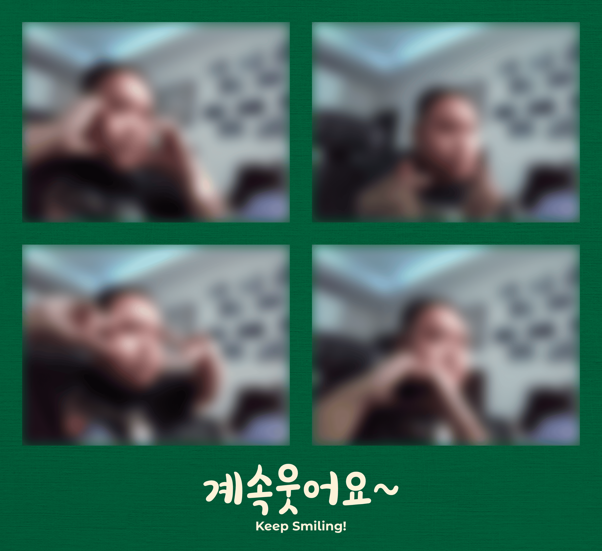
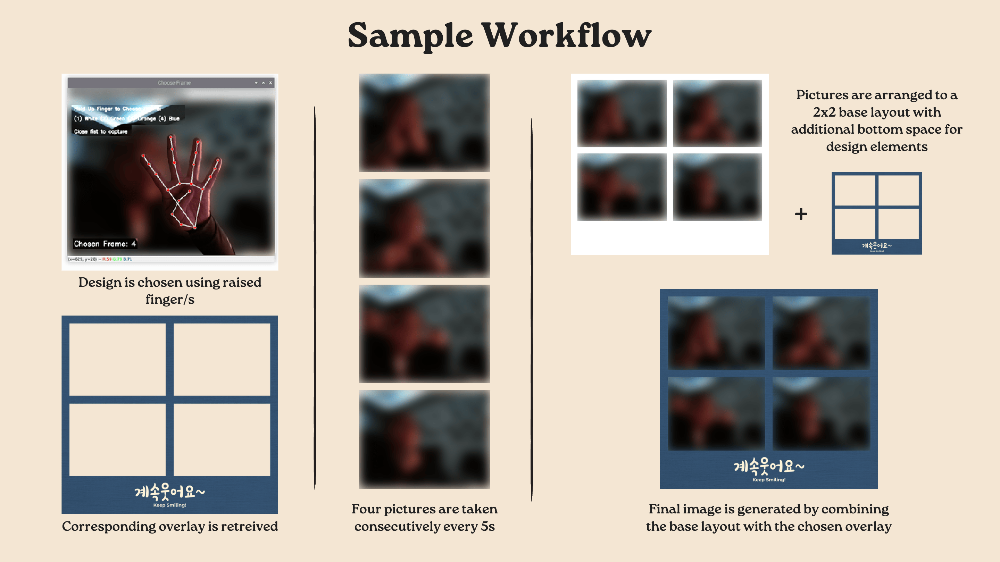

# Raspberry Pi Photobooth

A Raspberry Pi-powered photobooth that combines OpenCV and MediaPipe hand tracking to enable gesture-based frame selection before automatically capturing and generating a four-photo composite.

[](https://github.com/razospb?tab=repositories)
[](https://www.raspberrypi.com/software/)
[](https://www.python.org/)
[](LICENSE)


## Overview

Modern photobooths provide more than simply taking pictures—they create an interactive experience. This project demonstrates a Raspberry Pi-based photobooth that uses computer vision to recognize hand gestures for selecting decorative photo frames before automatically capturing a burst of photographs and generating a composite image.

Using OpenCV and Google's MediaPipe framework, the system continuously tracks the user's hand and counts the number of raised fingers to determine the desired photo frame. Once a closed fist is detected, the application begins an automated capture sequence, producing four photographs before arranging them into a final framed collage.

This project was developed as part of an undergraduate **Embedded Systems** laboratory exercise and is preserved here as an archived reference for Raspberry Pi and computer vision projects.


## Features

- Real-time hand tracking using MediaPipe
- Gesture-based frame selection
- Automated four-photo burst capture
- Composite image generation
- Decorative frame overlays
- Raspberry Pi Camera integration
- RGB LED flash indicator
- OpenCV image processing pipeline


## System Workflow

1. Initialize the Raspberry Pi camera and MediaPipe hand tracking.
2. Detect the user's hand and count the number of raised fingers.
3. Select one of four decorative photo frames.
4. Detect a closed fist to begin the capture sequence.
5. Capture four photographs at timed intervals.
6. Arrange the photographs into a 2×2 collage.
7. Apply the selected decorative frame.
8. Save the final composite image.


## Hardware

| Component | Purpose |
|-----------|---------|
| Raspberry Pi 4 Model B | Main controller |
| Raspberry Pi Camera Module V2 | Image acquisition |
| Common Anode RGB LED | Capture indicator |
| Breadboard & Jumper Wires | Prototyping |
| Monitor, Keyboard, Mouse | User interaction |


## Dependencies

Create and activate a Python virtual environment before installing the required packages.

```bash
python3 -m venv .venv

source .venv/bin/activate

pip install -r requirements.txt
```

The project depends on:

| Package | Purpose |
|---------|---------|
| OpenCV (`opencv-python`) | Camera access and image processing |
| MediaPipe | Hand tracking and landmark detection |
| Pillow | Image composition |
| RPi.GPIO | RGB LED control |


## Gallery

### Parts List



### Finger Detection
<table align="center">
  <tr>
    <th align="center">One-Finger Detection</th>
    <th align="center">Two-Finger Detection</th>
  </tr>
  <tr>
    <td align="center">
      
    </td>
    <td align="center">
      
    </td>
  </tr>
  <tr>
    <th align="center">Three-Finger Detection</th>
    <th align="center">Four-Finger Detection</th>
  </tr>
  <tr>
    <td align="center">
      
    </td>
    <td align="center">
      
    </td>
  </tr>
</table>

### Frame Designs
<table align="center">
  <tr>
    <th align="center">Plain ver.</th>
    <th align="center">"Forever" ver."</th>
  </tr>
  <tr>
    <td align="center">
      
    </td>
    <td align="center">
      
    </td>
  </tr>
  <tr>
    <th align="center">"Blast" ver.</th>
    <th align="center">"Glowing" ver.</th>
  </tr>
  <tr>
    <td align="center">
      
    </td>
    <td align="center">
      
    </td>
  </tr>
</table>

## Workflow




## Repository Structure

```text
assets/
├── frames/
│   ├── frame-1-plain.png
│   ├── frame-2-forever.png
│   ├── frame-3-blast.png
│   └── frame-4-glowing.png

images/
    Project documentation images

output/
    Generated burst photographs and composite image

photobooth.py
requirements.txt
README.md
LICENSE
```


## Building the Project

1. Clone the repository.
2. Create and activate a Python virtual environment.
3. Install the required Python packages.
4. Connect the Raspberry Pi Camera Module and RGB LED.
5. Run the application.


```bash
python photobooth.py
```


## Platform Notes

> [!IMPORTANT]
> This project was developed and tested on **Raspberry Pi OS** using a Raspberry Pi 4 Model B.

The application depends on the `RPi.GPIO` package for controlling the RGB status LED.

> [!WARNING] 
> As a result, it is **not expected to run on non-Raspberry Pi platforms without modification**.


## Future Improvements

Some ideas that were beyond the scope of the project include:

- Cross-platform GPIO abstraction
- Touchscreen user interface
- Additional frame templates
- Animated overlays
- Automatic printing support
- Cloud photo backup
- QR code download links
- Facial expression detection
- Countdown sound & visual effects


## Project Status

> [!IMPORTANT]
> This repository is archived and is no longer actively maintained.
>
> It is preserved as the final version of an undergraduate Embedded Systems laboratory exercise and may serve as a learning resource for Raspberry Pi, OpenCV, and MediaPipe projects.


## Authors

This project was developed by:

- Sean Patrick Razo
- Samuel Roy Malleta
- Jaymar Poñegal

This repository is maintained by Sean Patrick Razo as an archival copy of the final project.


## License

This project is released under the MIT License.

See the `LICENSE` file for details.